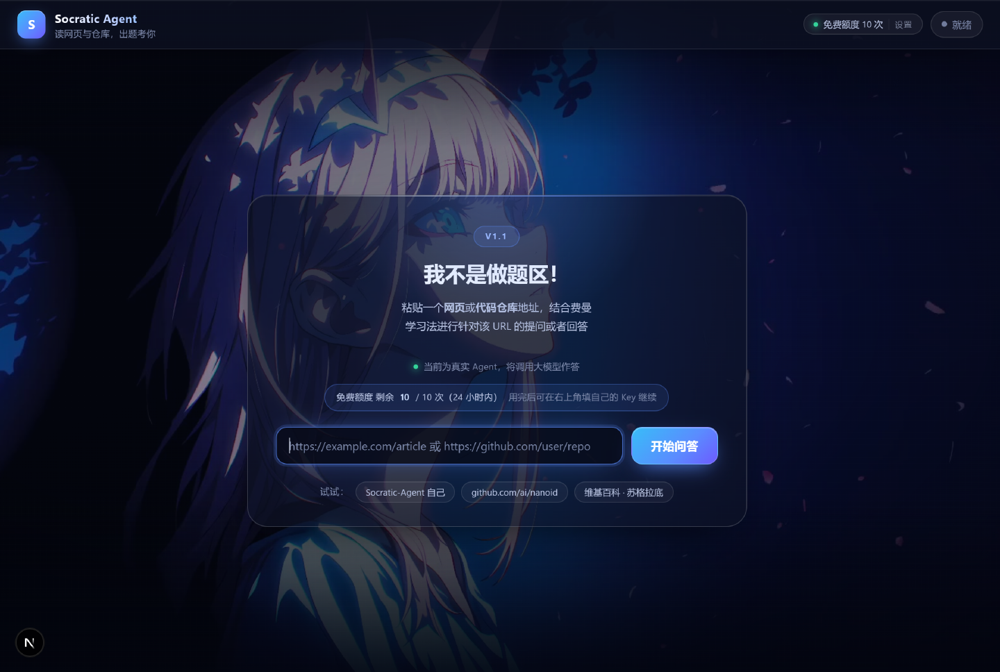
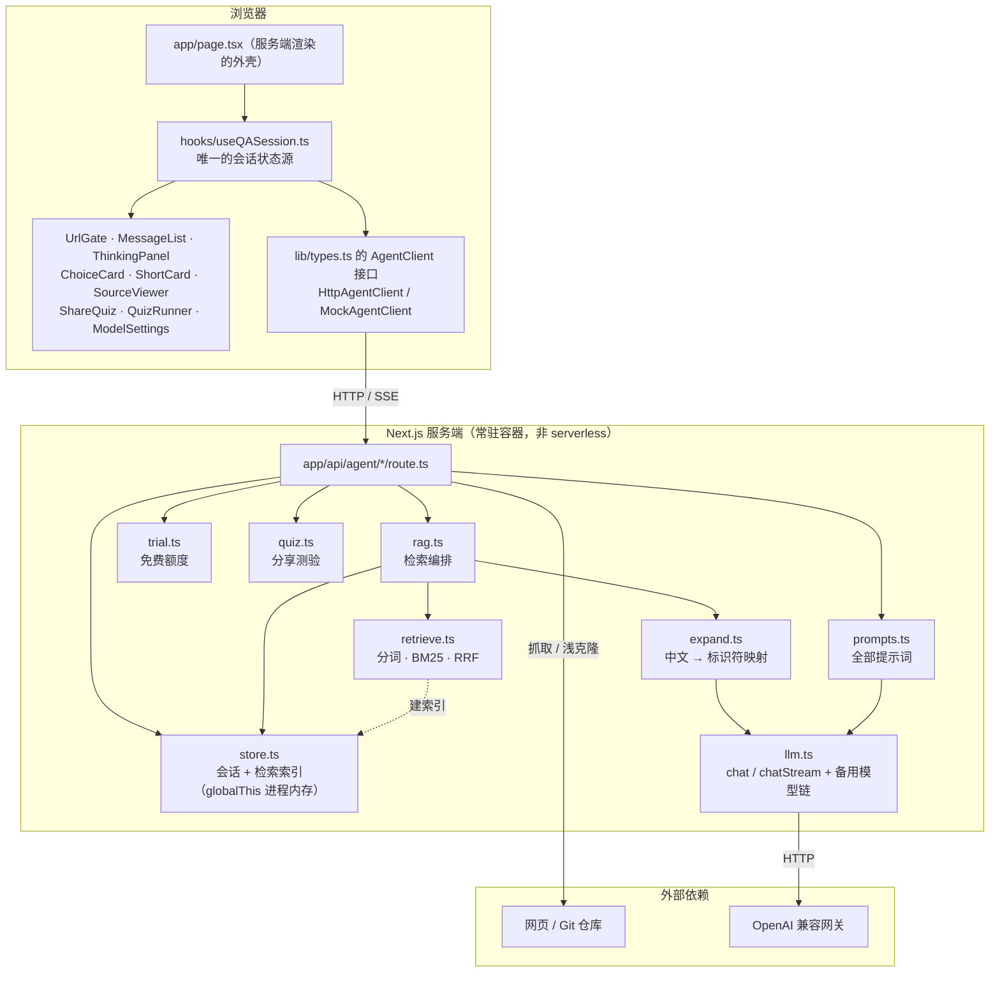
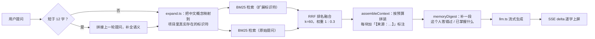
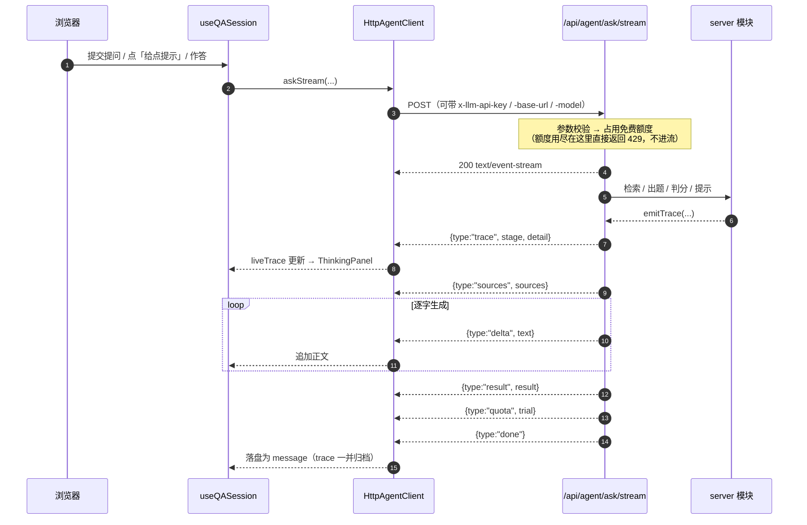

# Socratic Agent

**丢一个链接，用费曼学习法向它提问、作答，也可以让它出题考你。**

给它一个**网页**或**代码仓库**地址，它读完内容后你可以用**费曼学习法**向它提问、作答，
也可以让它出题考你 —— 选择题或简答题，题干锚定资料里真实存在的文件、函数和段落，
而不是通用八股。答错的题会成为后续出题的靶子。答案都来自检索到的原文。

## 线上地址

**https://socratic-agent-th9l.onrender.com**

托管在 Render 免费层，连接本仓库 `master` 分支自动部署 —— 推到 GitHub 即上线（配置见 `render.yaml`）。

> 免费层限制：15 分钟无流量会休眠（冷启动约 30-60 秒）、内存 512MB、无 shell 访问。

## 演示



## 功能

- **提问模式** —— 针对 URL 内容回答，答案来自检索到的原文，不靠模型的通用记忆
- **回答模式** —— 主动出题（选择题 / 简答题），题干锚定资料里真实存在的文件或函数
- **判分与计分** —— 选择题纯服务端比对（不调模型），简答题由模型批改；答对 +5 分
- **RAG 检索** —— 项目内容与你的作答记录进同一个索引，答错的题会成为后续出题的薄弱点
- **免费试用额度** —— 没带 Key 的访客先用服务端凭据免费试几次，用完再引导填自己的 Key
- **自带 API Key（BYOK）** —— 公开部署不必共享一个模型 Key，每个用户填自己的即可
- **分享测验** —— 把会话里已出的选择题打包成一条链接，别人打开就能做同一套题

## 本地快速开始

```bash
npm install
cp .env.example .env     # 填好 OPENAI_API_KEY / OPENAI_BASE_URL / LLM_MODEL
npm run dev              # http://localhost:3000
```

## 免费额度与自带 Key（BYOK）

**先给一小份免费额度，用完再引导自带 Key**。

### 用自己的 API Key（BYOK）

线上部署默认**不带**共享的模型密钥 —— 一个公开地址挂一个付费 Key，几分钟就会被刷爆。
所以应用支持让每个用户填自己的 Key：

1. 打开页面右上角的 **模型设置**（徽标会显示当前用的是哪份凭据）；
2. 选一个服务商预设（OpenRouter / DeepSeek / 硅基流动 / OpenAI）或直接填任意 OpenAI 兼容网关；
3. 填入 API Key，保存。

Key 只存在**你自己的浏览器**（localStorage），随每次请求通过 `x-llm-api-key` / `x-llm-base-url` /
`x-llm-model` 请求头发给服务端，服务端只在这一次请求里用它调模型，不落库、不写日志。

## 技术栈

Next.js 15（App Router）+ TypeScript + React 19。无 UI 框架，样式手写在 `globals.css`；运行时依赖只有 `next` / `react` / `react-dom`。

检索是自实现的 BM25 稀疏检索（零外部依赖），生成侧接任意 OpenAI 兼容网关。

**会话状态存在进程内存里，不依赖任何数据库** —— 所以必须上常驻容器，不能上 serverless。分享测验的数据也在同一份进程内存里，因此**重新部署会让已发出的分享链接失效**。

## 架构总览



改代码前先认三条：

- 页面组件只依赖 `AgentClient` 接口（`src/lib/types.ts`），**不直接 fetch**；`MockAgentClient` / `HttpAgentClient` 双实现。
- **答案只存服务端**（`correctIndex` / `explanation` / `reference` 从不下发）。
- 改行为优先改 `prompts.ts`，不要改路由。**出题逻辑只有一份**（`src/server/question.ts`），`/ask/stream` 与 `/question` 共用，不要复制。

## 检索管线（RAG）

### 提问模式：按相关性召回



索引里同时装着**项目内容**和**用户自己的历史**（作答记录、提过的问题，`origin: 'memory'`），所以「我刚才答错的那题考的是什么」也能召回到。

### 出题模式

出题时用户什么都没问，没有查询词可用，换了两步取材：

1. **薄弱点回捞** —— 取最近 3 道错题，用题干再检索一次原文，让新题是**同一知识点的另一个角度**，而不是换个说法重复。
2. **全项目均匀采样** —— 等距取样并按轮次错开起点，否则每次都从开头取，模型会反复考 README。

两者合并去重后按预算拼装；都没有时退回 `pickWindow()` 在正文里滚动取窗口。

### 为什么是 BM25 + RRF，而不是向量检索

- **现实约束**：能拿到的网关里，OpenRouter 的 `/embeddings` 返回 403、CodeBuddy 返回 404，**根本拿不到 embedding 接口**。做不了真向量检索，就不做一个跑不起来的假 RAG。而且在代码仓库场景，查询词几乎都是标识符（函数名、文件名、配置项），本就属于精确字面匹配的地盘。
- **分词是质量大头**：中文无脑切二元组会产出大量跨虚词碎片（`求是 / 是怎 / 么真`），随机命中任何一段中文。做法是把虚词当**切分点**（不是删掉后拼接），二元组便不跨越虚词边界；拉丁部分按 camelCase / snake_case 拆开，同时保留完整标识符。
- **标签加权 + 长度归一**：`LABEL_BOOST = 4`，问 `dispatchRequest` 时 `dispatchRequest.js` 要排在「某处注释提了一句」的块前面；`k1 = 1.2` / `b = 0.75` 防止长块靠体量霸榜。
- **真正的鸿沟是跨语言，不是语义**：中文问「请求是怎么发出去的」，代码里只有 `dispatchRequest`，字面零重叠，调参解决不了。所以由 `expand.ts` 让模型把中文概念映射到项目里**真实存在**的标识符上，返回的词再用标签语料校验一遍，编造的丢掉 —— 幻觉在这一步被过滤，这是它比向量检索更可验证的地方。只在提问含中文时触发，结果按 query 缓存，`RAG_EXPAND_QUERY=0` 可关。
- **融合为什么用 RRF 而不是把扩展词拼进原查询**：拼接是**分数相加**，`defaults` / `transformData` 这种宽泛词会把所在块抬到所有查询的第一名（实测如此）。RRF 只看排名不看分数（BM25 分值随语料规模浮动，两个查询变体的分数本就不可直接比较），公式 `score = Σ weight / (k + rank + 1)`，`k = 60`；权重 `1 : 0.3` 表示「扩展词比原始中文查询更可信」。

## SSE 事件流

提问、出题、判分、提示**全部走同一个 SSE 端点** `/api/agent/ask/stream`。理由不只是省代码：用户等待时最想看的是**思考过程**，而思考只存在于生成过程中，一次性 JSON 接口没法边算边说。



事件协议（`data:` 行内是 JSON）：

| 事件 | 载荷 | 什么时候发 |
| --- | --- | --- |
| `trace` | `{ stage, detail }` | 思考过程，一条一句话。分组是「检索 / 出题 / 判分 / 提示 / 生成 / 克隆」 |
| `status` | `{ text }` | 粗粒度状态，兼容旧前端 |
| `sources` | `{ sources }` | 提问模式：本次依据了哪些资料 |
| `delta` | `{ text }` | 提问模式：增量正文 |
| `result` | `{ result }` | 出题 / 判分 / 提示的结构化结果 |
| `quota` | `{ trial }` | 动作结束（成功与失败都发）时顺路带下最新额度 |
| `done` | — | 正常结束 |
| `error` | `{ error, retryable, code? }` | 出错，`error` 是归一化后的中文提示 |

几个设计点：

- **错误走事件，不走状态码**：一旦开始吐字，响应头已发出，改不了状态码。但**建流之前**的错误（参数错、会话失效、额度用尽）仍用正常状态码 —— 前端才能拿到结构化的 `trial` 当场弹设置面板。
- **额度在 `done` 之前发**，省掉一次 `/config` 往返；没产出任何 `delta` / `result` 才退还额度（上游 429 是常态，不退会把用户白扣到零）。
- **响应头必须带** `Cache-Control: no-cache, no-transform` 和 `X-Accel-Buffering: no`，否则中间层会把整个流攒完再吐。
- `liveTrace` 跟 `busy` 绑死，动作一结束就 `clear()`；`/context/stream`（解析 URL）用同一套 `trace` / `result` / `done` / `error` 协议。
- 提问模式优先走 `/ask/stream`；若在**吐字之前**失败会静默退回 `/ask`，已吐字则直接报错（重放会造成内容重复）。

## API

服务端位于 `src/app/api/agent/`：

| 端点 | 请求体 | 响应 |
| --- | --- | --- |
| `GET /config` | — | `{ llmConfigured, model, byok, trial }`，前端据此决定要不要引导用户填自己的 Key |
| `POST /context` | `{ url }` | `{ contextId, url, kind, title, summary, size, chunks }` |
| `POST /ask` | `{ contextId, question, history }` | `{ answer, sources, expanded }` |
| `POST /ask/stream` | 同上 | SSE：`status` / `sources` / `delta` / `result` / `quota` / `done` / `error` |
| `POST /question` | `{ contextId, mode, history }` | `{ id, type, prompt, options?, sources }` |
| `POST /grade` | `{ contextId, type, questionId, selectedIndex \| question, answer }` | `ChoiceGrade \| ShortGrade` |
| `POST /hint` | `{ contextId, type, questionId, question? }` | `{ hint }` —— 「给点提示」：只给启发式引导，不判分、不给答案 |
| `POST /source` | `{ contextId, label }` | `SourceView` —— 引用来源详情。`label` 就是 `sources` 数组里的元素；仓库按文件聚合全部索引块并把被引用段标进 `focus`，网页只给被引用章节 |
| `POST /quiz` | `{ contextId }` | `{ quizId, title, sourceUrl, count, players }` —— 把会话里已出的选择题打包成一条分享链接。**不占免费额度**；对同一会话幂等 |
| `GET /quiz/{id}` | — | `{ id, title, sourceUrl, count, players, questions }` —— **不含答案键** |
| `POST /quiz/{id}` | `{ questionId, selectedIndex, player? }` | `{ correct, correctIndex, explanation }` —— 纯服务端比对，不调模型、不占额度、不写用户记忆 |

状态码：`400` 参数错误 · `404` 该引用来源或测验查不到 · `410` 会话或答案键失效 · `429` 免费额度用尽 · `502` 上游失败。

`/quiz` 与 `/quiz/{id}` 是**公开端点**：没有会话、不需要任何凭据，链接本身就是凭证。

`429` 的响应体是 `{ error, code: "trial_exhausted", trial: {...} }`；`trial` 字段为
`{ available, limit, used, remaining, resetsInMs }`。流式端点在动作结束时（成功与失败都算）
也会发一条 `{ type: "quota", trial }`，前端据此刷新额度。

所有 `POST` 端点都接受可选的 `x-llm-api-key` / `x-llm-base-url` / `x-llm-model` 请求头（BYOK），
带了就用这份凭据调模型，没带就用服务端 `.env` 里的。

## 目录结构

```
src/
├── app/          页面与 API 路由
├── components/   UI 组件
├── hooks/        会话状态（useQASession）
├── lib/          类型契约与 AgentClient 实现
└── server/       检索、提示词、会话存储、内容解析
scripts/
└── start.mjs     启动包装器（读 PORT、绑 0.0.0.0）
docs/             README 用的截图与演示素材
render.yaml       Render 部署配置
```

服务端各文件的职责见文件名与文件头注释。

## 开发说明

- 页面组件只依赖 `AgentClient` 接口，不直接 fetch 后端；改行为优先改提示词 `src/server/prompts.ts`，不要改路由（理由见「架构总览」）
- `npm run typecheck` 做类型检查；`npm run dev` 走 Turbopack —— **不要改回 webpack**（webpack 模式下 `next dev` 会同步等待 `registry.npmjs.org` 的版本检查，没有超时也没有 abort 兜底，代理不通时页面会卡住约 45 秒）
- `/api/agent/inspect` 是**仅开发环境**可用的检索调试端点，production 下返回 404
- 端到端回归脚本放在 `.tmp/`（**gitignored，不在仓库里**）。改动文案 / OG / 分享测验后务必重跑，只跑 `npm run typecheck` 不算验证

